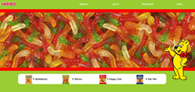

#  하리보  홈페이지 *redesign*   
[🚀페이지 보러가기](https://ggang89.github.io/academy_haribo/)
### ✔ 기획의도   
* 자유롭게 주제를 정한 후 홈페이지를 새롭게 디자인 해보기   
    > #### "껌은 지고 젤리의 시대가 왔다"  

    젤리의 시대다. 입가심으로 껌 대신 젤리를 씹고, 건강을 위해 '젤리형 숙취해소제'를 마시고 '영양 젤리'를 삼킨다.    
     **변화한 간식 시장**의 강자인 젤리! 그 중심에 **하리보**가 있다.    
    국내 매출 1위, 시장점유율 1위, 유럽에서 가장 신뢰받는 브랜드 **하리보**의 특색을 살리는 홈페이지를 만들어본다.   

### ✔ 완성본 

### ✔ 기능
1. 메인   
    * 하리보 제품 포장지를 활용해서 대표 제품 소개   
     *  하단 메뉴바 클릭시 **메인 페이지 이미지 변경**   
     

2. 하리보의 주요 이벤트 소개    
    * 링크 클릭시, 소개 페이지로 이동   

3. 기업의 역사, 특징 소개   
   * CARD 이미지 안에 간단한 특징 요약   
     * 클릭시 상세페이지로 이동

4. 모바일 버전   
    * width가 **949px이하**의 기기 전용 페이지   

||||
|:----:|:----:|:----:|
|main|2page|3page|

|  ||
|:----:|:----:|
| 4page |5page|

### ✔ 팀 구성 & 역할
  * 팀 인원 : 2명
  * 참여 부분   
     *  제품 선정 및 전체 기획   
     *  html 구조 및 2, 3, 4 page 구성

### ✔ 기술스택   
 * HTML, CSS , Jquery